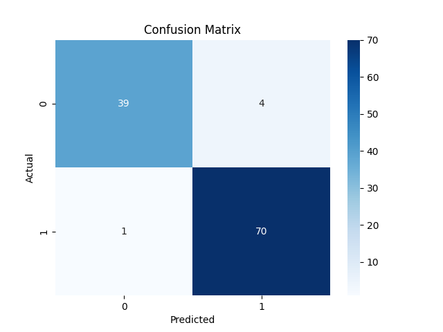

BREAST CANCER PREDICTION USING MACHINE LEARNING

## Project Overview

This project predicts whether a tumor is **malignant (cancerous)** or **benign (non-cancerous)** using Machine Learning.
The model is trained on the **Breast Cancer Wisconsin dataset** available in Scikit-learn.

## Dataset

The dataset used is the **Breast Cancer Wisconsin dataset** provided by the Scikit-learn library.
It contains medical measurements of cell nuclei from breast cancer biopsies.

**Dataset details**

* Total samples: 569
* Features: 30
* Target classes:

  * Malignant
  * Benign

## Algorithm Used

The Machine Learning algorithm used in this project is:

* Logistic Regression

This algorithm is commonly used for **binary classification problems**.

## Model Accuracy

The trained model achieved an accuracy of approximately:

**95.6%**

## Tools and Libraries

The following tools and Python libraries were used:

* Python
* Scikit-learn
* NumPy
* Pandas
* Matplotlib
* Seaborn

## Project Structure

Breast_Cancer_Prediction
│
├── breast_cancer_prediction.py
├── confusion_matrix.png
└── README.md

## Model Output

### Confusion Matrix

The confusion matrix shows how well the model classified malignant and benign tumors.

---

## Conclusion

The Machine Learning model successfully predicts whether a tumor is malignant or benign with high accuracy.
This project demonstrates how Machine Learning can assist in **medical diagnosis and decision support systems**.
